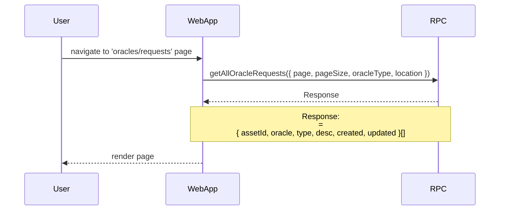

#All Requests to Oracles

```mermaid
sequenceDiagram
User->>WebApp: navigate to 'oracles/requests' page
WebApp->>RPC: getAllOracleRequests({ page, pageSize, oracleType, location })
RPC-->>WebApp:  Response
Note over WebApp, RPC: Response: <br> = <br> { assetId, oracle, type, desc, created, updated }[]
WebApp-->>User: render page
```
