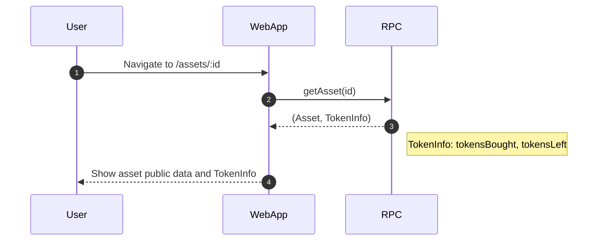

# Asset Details Page

```mermaid
sequenceDiagram
autonumber

participant User
participant WebApp
participant RPC
User->>WebApp: Navigate to /assets/:id
WebApp->>RPC: getAsset(id)
RPC-->>WebApp: (Asset, TokenInfo)
Note right of RPC: TokenInfo: tokensBought, tokensLeft
WebApp-->>User: Show asset public data and TokenInfo
```
