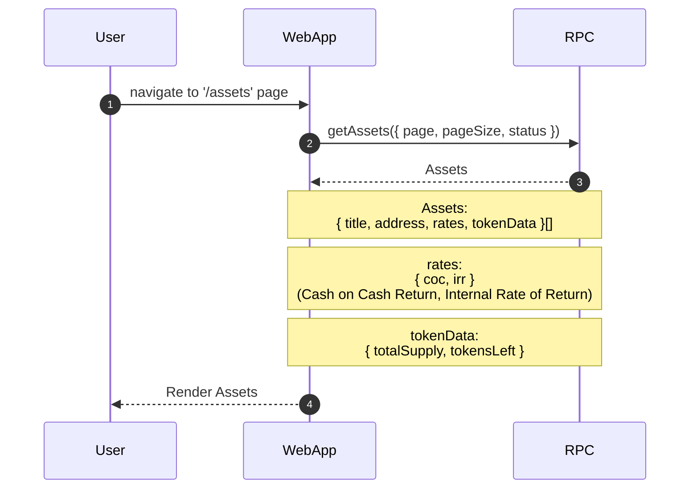
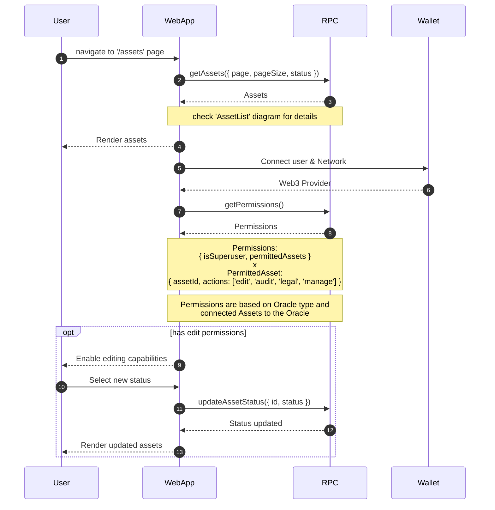

#Asset List Page

## Asset List

```mermaid
sequenceDiagram
autonumber

User->>WebApp: navigate to '/assets' page
WebApp->>RPC: getAssets({ page, pageSize, status })
RPC-->>WebApp: Assets
Note over WebApp, RPC: Assets:<br> { title, address, rates, tokenData }[]
Note over WebApp, RPC: rates: <br>{ coc, irr } <br> (Cash on Cash Return, Internal Rate of Return) 
Note over WebApp, RPC: tokenData: <br>{ totalSupply, tokensLeft }
WebApp-->>User: Render Assets
```

## Update Asset Status

```mermaid
sequenceDiagram
autonumber

User->>WebApp: navigate to '/assets' page
WebApp->>RPC: getAssets({ page, pageSize, status })
RPC-->>WebApp: Assets
Note over WebApp, RPC: check 'AssetList' diagram for details
WebApp-->>User: Render assets
WebApp->>Wallet: Connect user & Network
Wallet-->>WebApp: Web3 Provider
WebApp->>RPC: getPermissions()
RPC-->>WebApp: Permissions
Note over WebApp, RPC: Permissions:<br> { isSuperuser, permittedAssets } <br>x<br> PermittedAsset: <br>{ assetId, actions: ['edit', 'audit', 'legal', 'manage']  }
Note over WebApp, RPC: Permissions are based on Oracle type and <br>connected Assets to the Oracle
opt has edit permissions
  WebApp-->>User: Enable editing capabilities
  User->>WebApp: Select new status
  WebApp->>RPC: updateAssetStatus({ id, status })
  RPC-->>WebApp: Status updated
  WebApp-->>User: Render updated assets

end  
```
