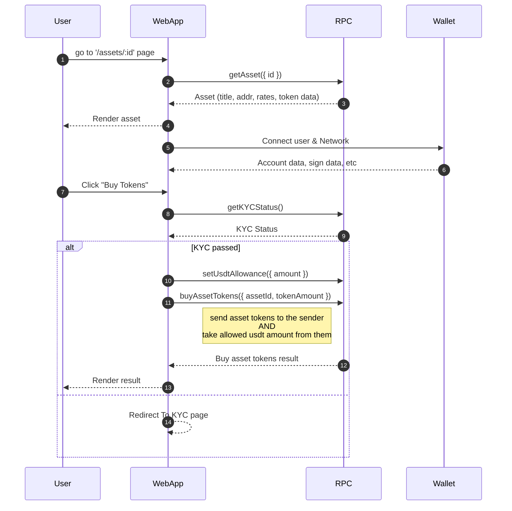

#Buy Asset Tokens Flow

## 

```mermaid
sequenceDiagram
autonumber

User->>WebApp: go to '/assets/:id' page
WebApp->>RPC: getAsset({ id })
RPC-->>WebApp: Asset (title, addr, rates, token data)
WebApp-->>User: Render asset
WebApp->>Wallet: Connect user & Network
Wallet-->> WebApp: Account data, sign data, etc
User->>WebApp: Click "Buy Tokens"
WebApp->>RPC: getKYCStatus()
RPC-->>WebApp: KYC Status
alt KYC passed
  WebApp->>RPC: setUsdtAllowance({ amount })
  WebApp->>RPC: buyAssetTokens({ assetId, tokenAmount })
  Note left of RPC:  send asset tokens to the sender <br>AND <br>take allowed usdt amount from them
  RPC-->>WebApp: Buy asset tokens result
  WebApp-->>User: Render result
else
  WebApp-->>WebApp: Redirect To KYC page
end
```
