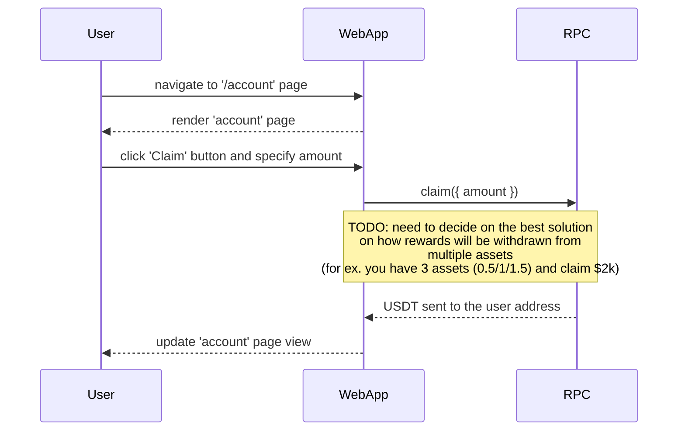
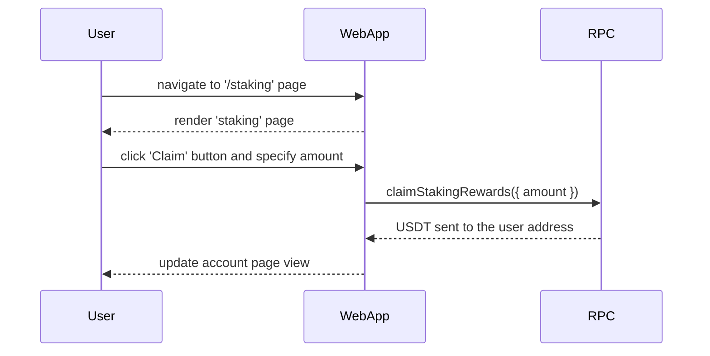

#Claim Rental Rewards

```mermaid
sequenceDiagram
User->>WebApp: navigate to '/account' page
WebApp-->>User: render 'account' page
User->>WebApp: click 'Claim' button and specify amount
WebApp->>RPC: claim({ amount })
Note over WebApp, RPC: TODO: need to decide on the best solution <br> on how rewards will be withdrawn from <br> multiple assets <br> (for ex. you have 3 assets (0.5/1/1.5) and claim $2k)
RPC-->>WebApp: USDT sent to the user address
WebApp-->>User: update 'account' page view
```

#Claim BNRX Staking Rewards

```mermaid
sequenceDiagram
User->>WebApp: navigate to '/staking' page
WebApp-->>User: render 'staking' page
User->>WebApp: click 'Claim' button and specify amount
WebApp->>RPC: claimStakingRewards({ amount })
RPC-->>WebApp: USDT sent to the user address
WebApp-->>User: update account page view
```

