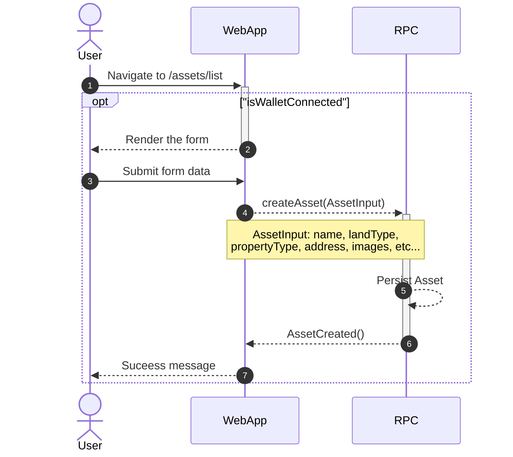

# List Asset

```mermaid
sequenceDiagram
autonumber

actor U as User
participant W as WebApp
participant RPC

U->>+W: Navigate to /assets/list
  
opt "isWalletConnected"
  W-->>-U: Render the form
  U->>W: Submit form data
  W-->>+RPC: createAsset(AssetInput)
  Note over W, RPC: AssetInput: name, landType,<br>propertyType, address, images, etc...
  RPC-->>RPC: Persist Asset 
  RPC-->>-W: AssetCreated()
  W-->>U: Suceess message
end
```
