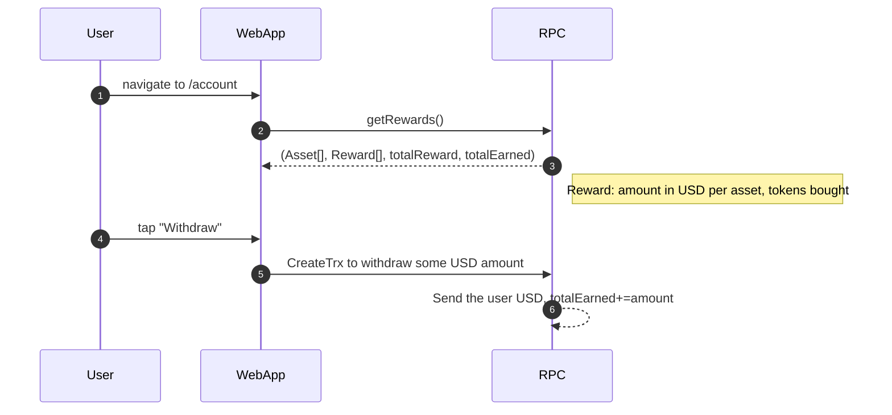

# My Account Page

```mermaid
sequenceDiagram
autonumber

  participant User
  participant WebApp
  participant RPC
  User->>WebApp: navigate to /account
  WebApp->>RPC: getRewards()
  RPC-->>WebApp: (Asset[], Reward[], totalReward, totalEarned)
  Note right of RPC: Reward: amount in USD per asset, tokens bought
  
  User->>WebApp: tap "Withdraw"
  WebApp->>RPC: CreateTrx to withdraw some USD amount
  RPC-->>RPC: Send the user USD, totalEarned+=amount
  
```
