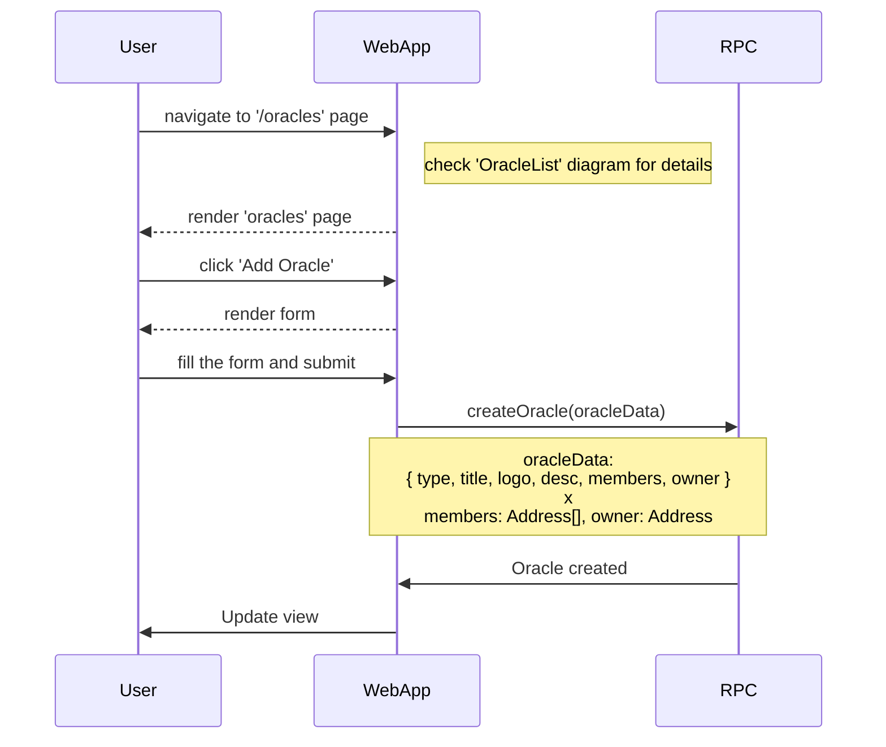
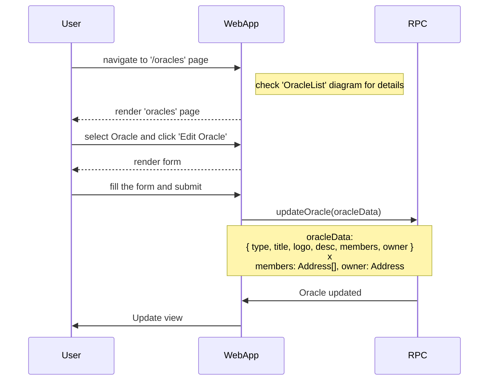
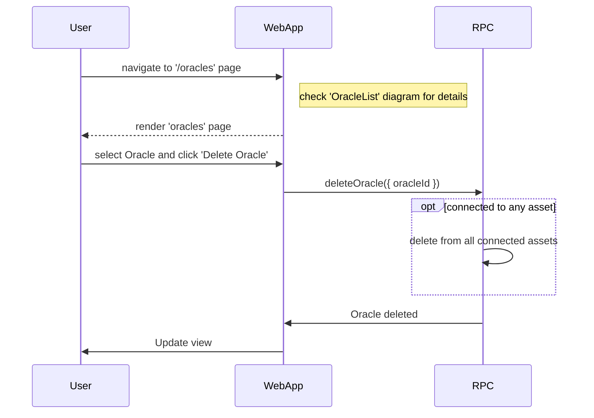

#Oracle CRUD

## MVP Variant

### Create Oracle

```mermaid
sequenceDiagram
User->>WebApp: navigate to '/oracles' page
Note right of WebApp: check 'OracleList' diagram for details
WebApp-->>User: render 'oracles' page
User->>WebApp: click 'Add Oracle'
WebApp-->>User: render form
User->>WebApp: fill the form and submit
WebApp->>RPC: createOracle(oracleData)
Note over WebApp, RPC: oracleData: <br>{ type, title, logo, desc, members, owner } <br>x<br>members: Address[], owner: Address
RPC->>WebApp: Oracle created
WebApp->>User: Update view
```

### Update Oracle

```mermaid
sequenceDiagram
User->>WebApp: navigate to '/oracles' page
Note right of WebApp: check 'OracleList' diagram for details
WebApp-->>User: render 'oracles' page
User->>WebApp: select Oracle and click 'Edit Oracle'
WebApp-->>User: render form
User->>WebApp: fill the form and submit
WebApp->>RPC: updateOracle(oracleData)
Note over WebApp, RPC: oracleData: <br>{ type, title, logo, desc, members, owner } <br>x<br>members: Address[], owner: Address
RPC->>WebApp: Oracle updated
WebApp->>User: Update view
```

### Delete Oracle

```mermaid
sequenceDiagram
User->>WebApp: navigate to '/oracles' page
Note right of WebApp: check 'OracleList' diagram for details
WebApp-->>User: render 'oracles' page
User->>WebApp: select Oracle and click 'Delete Oracle'
WebApp->>RPC: deleteOracle({ oracleId })
opt connected to any asset
  RPC->>RPC: delete from all connected assets
end
RPC->>WebApp: Oracle deleted
WebApp->>User: Update view  

```
