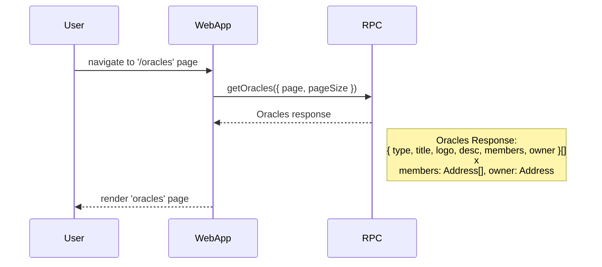

#Oracle List

```mermaid
sequenceDiagram
User->>WebApp: navigate to '/oracles' page
WebApp->>RPC: getOracles({ page, pageSize })
RPC-->>WebApp: Oracles response
Note right of RPC: Oracles Response: <br>{ type, title, logo, desc, members, owner }[] <br>x<br>members: Address[], owner: Address
WebApp-->>User: render 'oracles' page
```
