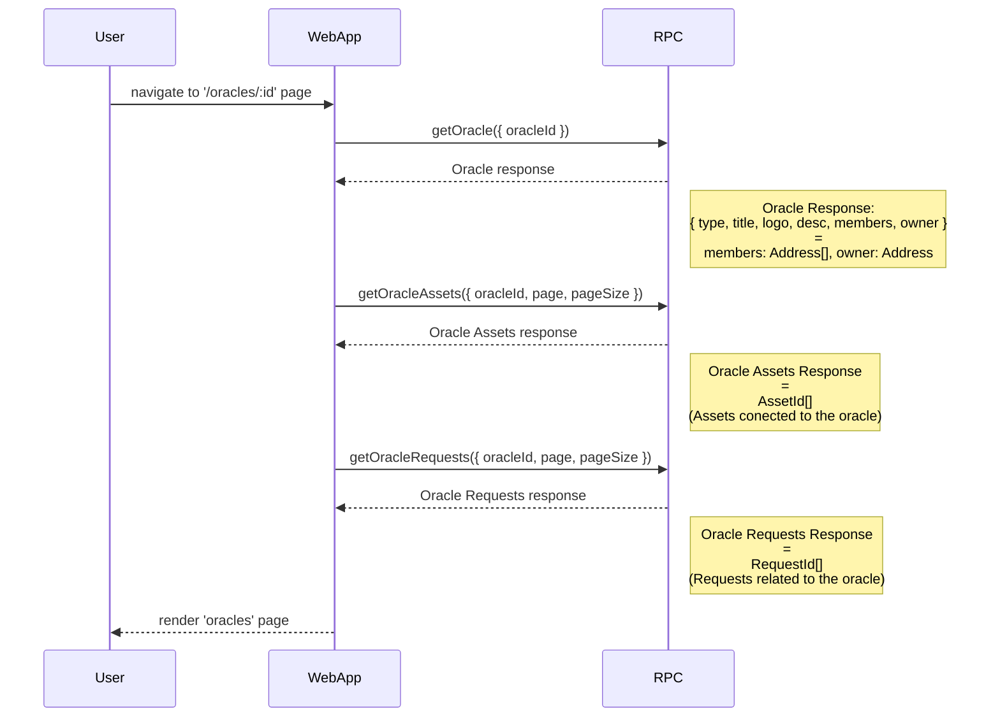

#Oracle Page

```mermaid
sequenceDiagram
User->>WebApp: navigate to '/oracles/:id' page
WebApp->>RPC: getOracle({ oracleId })
RPC-->>WebApp: Oracle response
Note right of RPC: Oracle Response: <br>{ type, title, logo, desc, members, owner } <br>=<br>members: Address[], owner: Address
WebApp->>RPC: getOracleAssets({ oracleId, page, pageSize })
RPC-->>WebApp: Oracle Assets response
Note right of RPC: Oracle Assets Response <br> = <br> AssetId[] <br> (Assets conected to the oracle)  
WebApp->>RPC: getOracleRequests({ oracleId, page, pageSize })
RPC-->>WebApp: Oracle Requests response
Note right of RPC: Oracle Requests Response <br> = <br> RequestId[] <br> (Requests related to the oracle)  
WebApp-->>User: render 'oracles' page
```
