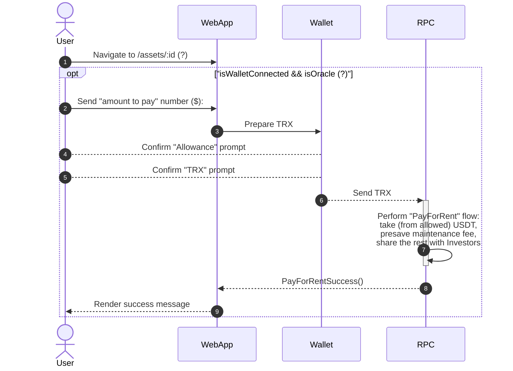

# Pay For Rent

```mermaid
sequenceDiagram
autonumber

actor U as User
participant W as WebApp
participant WL as Wallet
participant RPC

U->>W: Navigate to /assets/:id (?)

opt "isWalletConnected && isOracle (?)"
  U->>W: Send "amount to pay" number ($):
  W->>WL: Prepare TRX
  U-->WL: Confirm "Allowance" prompt
  U-->WL: Confirm "TRX" prompt
  WL-->>+RPC: Send TRX
  RPC->>-RPC: Perform "PayForRent" flow:<br> take (from allowed) USDT,<br>presave maintenance fee,<br> share the rest with Investors 
  RPC-->>W: PayForRentSuccess()
  W-->>U: Render success message
end
```
