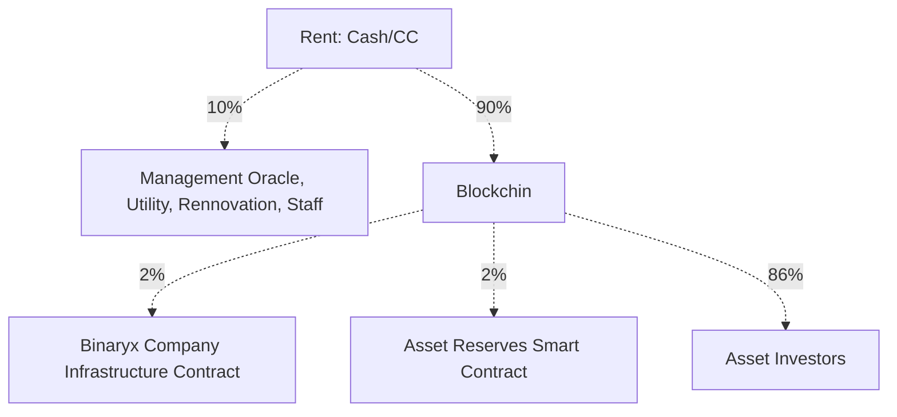

# WIP: Rewards Distribution

## Rent distribution



## Investment distribution

```mermaid
flowchart

AI[Asset Investors - USDT] -. 2% .-> AssetReserves[Asset Reserves Smart Contract]
AI-. 5% .-> BNRX["."]

BNRX -. 0.5% .-> BCIC[Binaryx Company Infrastructure Contract]
BNRX -. 4.5% .-> BNRXH[Binaryx holders]

AI -. 93% .-> REST["."]
REST -. N% or fixed .-> LSF[Legal Setup Fee]
REST -. N% or fixed .-> AF[Audit Fee]
REST -. 93% - Legal Setup Fee - Audit Fee.-> PSSC[Property Seller Smart Contract]

```

