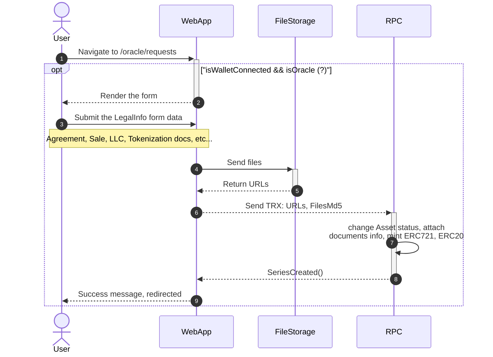

# Series Company Registering

```mermaid
sequenceDiagram
autonumber

actor U as User
participant W as WebApp
participant FS as FileStorage
participant RPC

U->>+W: Navigate to /oracle/requests

opt "isWalletConnected && isOracle (?)"
  W-->>-U: Render the form
  U->>W: Submit the LegalInfo form data
  Note over U, W: Agreement, Sale, LLC, Tokenization docs, etc...
  W->>+FS: Send files
  FS-->>-W: Return URLs
  W-->>+RPC: Send TRX: URLs, FilesMd5
  RPC->>RPC: change Asset status, attach <br>documents info, mint ERC721, ERC20
  RPC-->>-W: SeriesCreated()
  W-->>U: Success message, redirected
end
```
